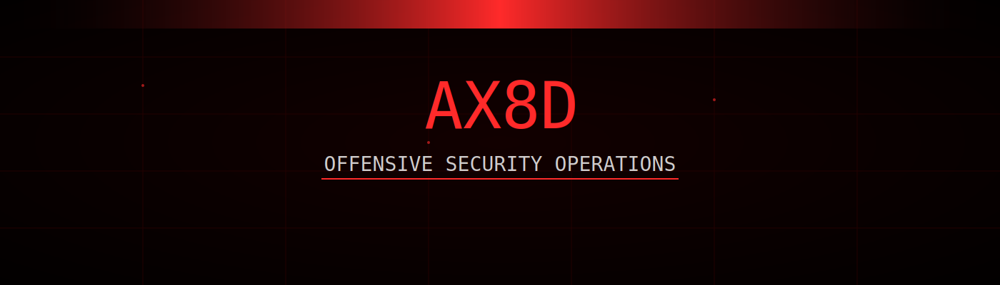

 

 

---

## 👤 Identity Node

# Ahmed Haytham
### Offensive Security • AI Red Teaming • Bug Bounty Research

---

## 🧠 Operational Scope

<table>
<tr>

<td align="center" width="260">

### 🌐 Web Exploitation

Authentication bypass  
Authorization flaws  
Business logic abuse  
OWASP methodology

</td>

<td align="center" width="260">

### 🔗 API Security

REST / GraphQL abuse  
Broken access control  
Mass assignment  
API reconnaissance

</td>

</tr>
<tr>

<td align="center" width="260">

### 🤖 AI Security

Prompt injection  
LLM jailbreak testing  
Agent exploitation  
Adversarial inputs

</td>

<td align="center" width="260">

### 🎯 Attack Engineering

Reconnaissance  
Attack surface mapping  
Exploit chaining  
Responsible disclosure

</td>

</tr>
</table>

---

## 🛠 Security Stack

### Core Environment

### Offensive Tooling

### Recon & Exploitation Utilities

---

## 📡 Live Telemetry

---

## 📊 Attack Activity Graph

---

## 🌐 Network Endpoints

---

## 👁‍🗨 My Vision

### FIND • EXPLOIT • REPORT • SECURE

 

<i>
Security is not about preventing every attack.  
It is about discovering weaknesses before they are weaponized.
</i>

---

